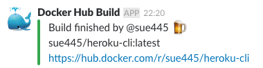
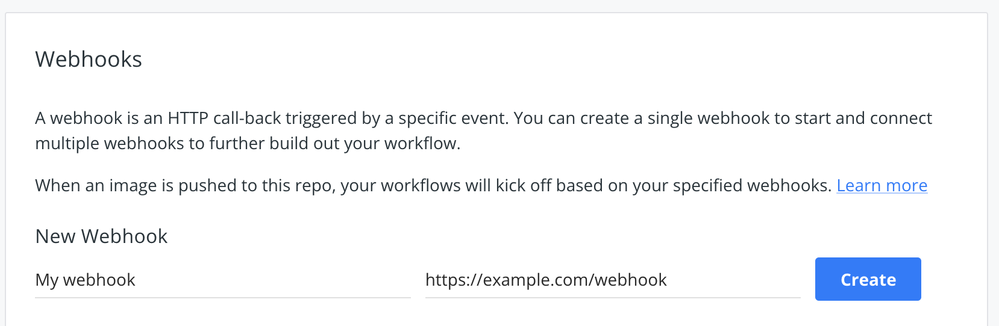

# dockerhub-slack-webhook
[Docker Hub](https://hub.docker.com/) webhook for slack notification after build

## Usage
### 1. Create Incoming WebHook URL
https://slack.com/apps/A0F7XDUAZ-incoming-webhooks

### 2. Create heroku app from following "Deploy to Heroku" button

### 3. Register webhook to Docker Hub
Register webhook url

e.g. 

* `https://MY-APP-NAME.herokuapp.com/webhook`
  * Without `channel` query, notify to `SLACK_CHANNEL`
* `https://MY-APP-NAME.herokuapp.com/webhook?channel=other_channel`
  * With `channel` query, notify to specific channel. (`#` is needless)

### 4. Push image to Docker Hub
